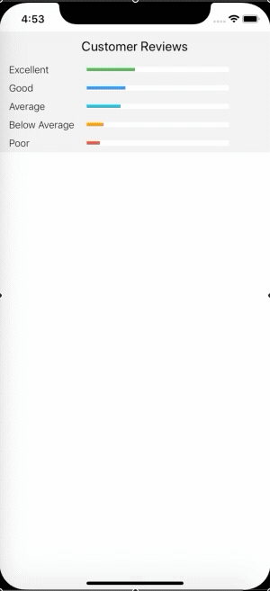
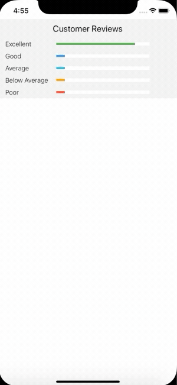

# react-native-customer-review-bars

> A customizables ListView that allows you to display customer review scale.

## Install

Using NPM

```sh
npm install react-native-customer-review-bars
```

Using Yarn

```sh
yarn add react-native-customer-review-bars
```

## Example

|                        |                            |
| :--------------------- | :------------------------: |
|  |  |

## Usage

```js
import React, { Component } from "react";
import { View } from "react-native";
import Review from "react-native-customer-review-bars";

const reviews = [
  { value: 10000 },
  { value: 500 },
  { value: 456 },
  { value: 350 },
  { value: 500 }
];
// --- OR ---
// const  reviews = [
//   { value: 10000 , type:"Excellent"},
//   { value: 500 ,type:"Great"},
//   { value: 456 },
//   { value: 350 },
//   { value: 500 }
// ];
// to make custom messages
class App extends Component {
  render() {
    return <Review reviews={reviews} />;
  }
}
export default App;
```

## Properties

| Prop            |                          Default                          |   Type   | Description                                                                                                             |
| :-------------- | :-------------------------------------------------------: | :------: | :---------------------------------------------------------------------------------------------------------------------- |
| reviews         |                           `[]`                            | `array`  | All items available in the list (array of `string` or `{ type, value }`)                                                |  |
| showPercentage  |                          `false`                          |  `bool`  | Display percentage of reviews                                                                                           |
| showCount       |                          `false`                          |  `bool`  | Display count of reviews                                                                                                |
| colors          | `["#4CAF50", "#2196F3", "#00bcd4", "#ff9800", "#f44336"]` | `Array`  | Change color of bars                                                                                                    |  |
| reviewTypeStyle |                           `{}`                            | `object` | [Style](https://facebook.github.io/react-native/docs/text.html#style) for the "type" label.                             |  |
| rightTextStyle  |                           `{}`                            | `object` | [Style](https://facebook.github.io/react-native/docs/text.html#style) for the "percentage or value" label.              |  |
| flatListProps   |                           `{}`                            | `object` | [FlatList](https://facebook.github.io/react-native/docs/flatlist#docsNav) for pass flatlist props inside the component. |  |
| barStyle        |                           `{}`                            | `object` | [Style](https://facebook.github.io/react-native/docs/text.html#style) for the "empty barStyle" style.                   |  |
| barFillStyle    |                           `{}`                            | `object` | [Style](https://facebook.github.io/react-native/docs/text.html#style) for the "filled bar" style.                       |  |

## License

© Suraj Sanwal
